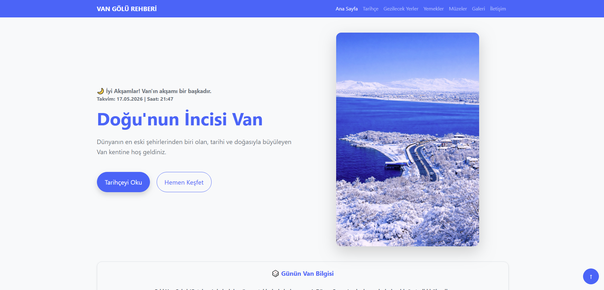
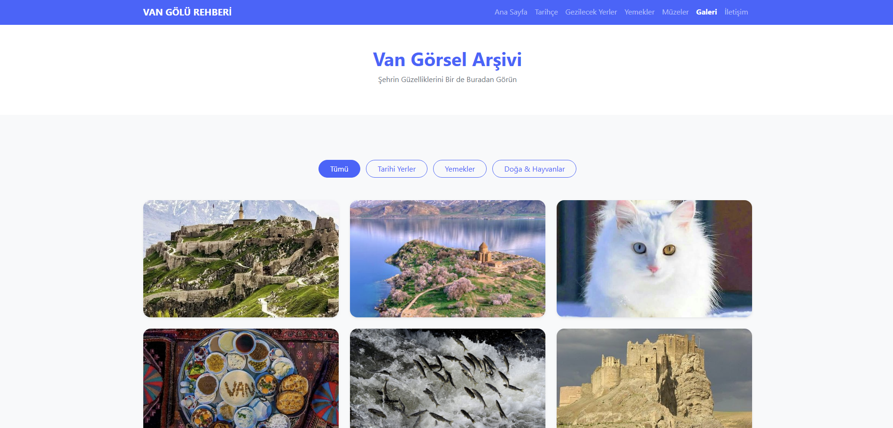
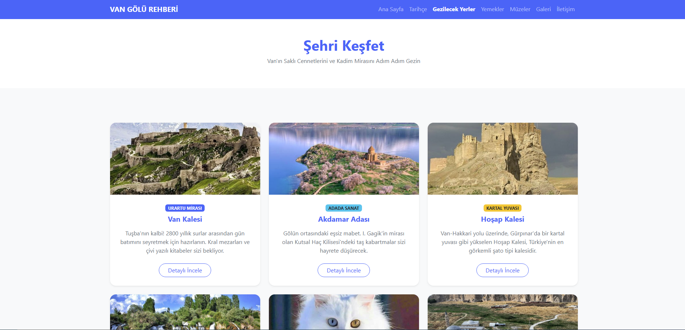
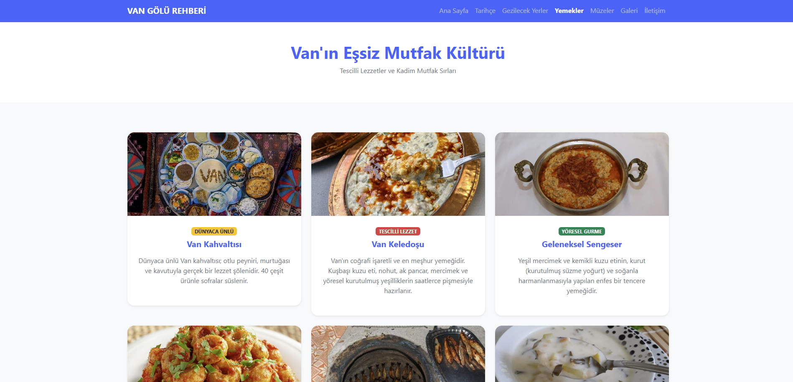
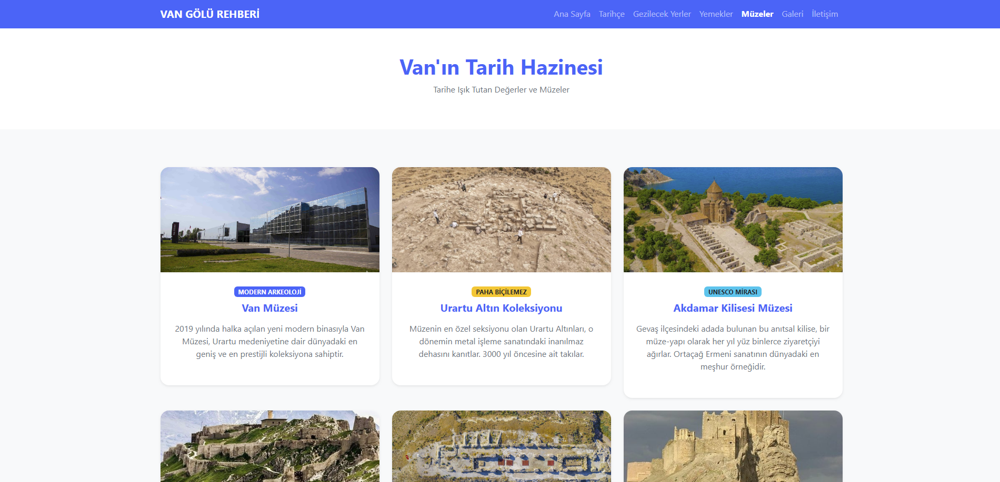
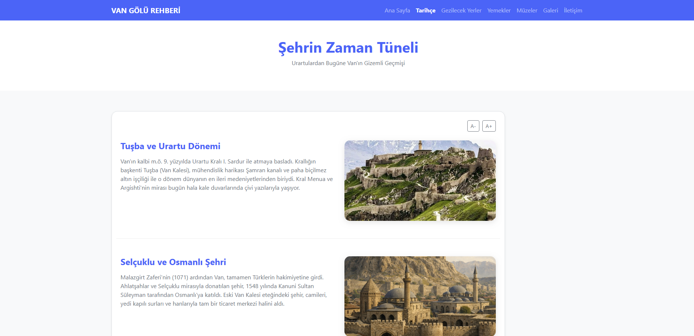
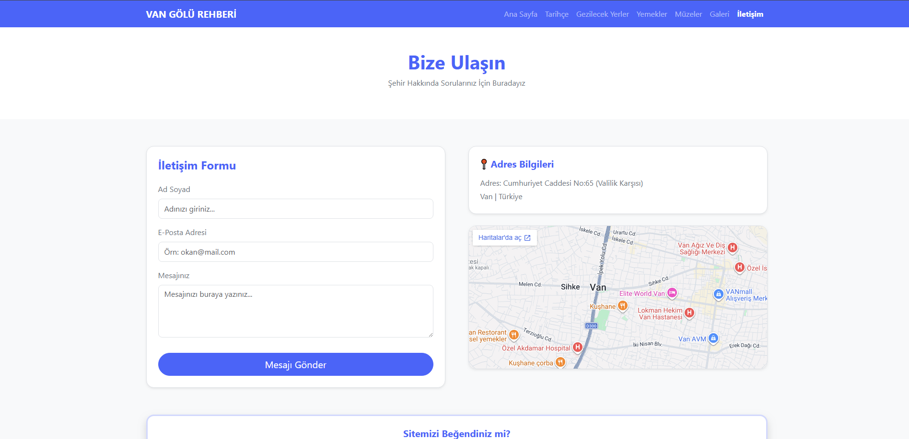

<p align="center">
  
</p>

<h1 align="center">🐾 Van Şehir Rehberi</h1>

<p align="center">
  <strong>Van'ı keşfetmek için interaktif bir şehir rehberi</strong>
  <br>
  11. sınıf HTML, CSS, Bootstrap & jQuery proje ödevi
</p>

<p align="center">
  
  
  
  
  
</p>

---

## 📸 Ekran Görüntüleri

| Sayfa | Görünüm |
|-------|---------|
| **Ana Sayfa** |  |
| **Galeri** |  |
| **Gezilecek Yerler** |  |
| **Yemekler** |  |
| **Müzeler** |  |
| **Tarihçe** |  |
| **İletişim** |  |

## ✨ Özellikler

| # | Özellik | Açıklama |
|---|---------|----------|
| 🏠 | **Ana Sayfa** | Saat bazlı selamlama, günün Van bilgisi widget'ı, ziyaretçi sayacı, emoji oylama |
| 📜 | **Tarihçe** | Van'ın köklü geçmişi hakkında detaylı bilgiler |
| 🗺️ | **Gezilecek Yerler** | Van Kalesi, Akdamar Adası, Hoşap Kalesi ve daha fazlası |
| 🍽️ | **Yemekler** | Otlu peynir, murtuğa, keledoş, ayran aşı gibi Van lezzetleri |
| 🏛️ | **Müzeler** | Van Müzesi ve diğer kültürel miras noktaları |
| 🖼️ | **Galeri** | Kategorilere göre filtreleme (tarihi, yemek, doğa) |
| ✉️ | **İletişim** | Form validasyonlu iletişim sayfası |
| 🔍 | **Detay Sayfaları** | Her mekan, lezzet ve canlı için özel içerik sayfaları |
| 🎯 | **Sürpriz** | Klavyede "van" yazınca gizli içerik + müzik |
| 🖱️ | **Resim Modal** | Görsellere tıklayınca büyütme özelliği |
| 📝 | **Yazı Boyutu** | Metin boyutunu artırıp azaltma |

## 🛠️ Kullanılan Teknolojiler

| Teknoloji | Amaç |
|-----------|------|
| **HTML5** | Sayfa yapısı ve içerik |
| **CSS3** (Bootstrap 5.3) | Duyarlı tasarım, kartlar, navbar, grid sistemi |
| **JavaScript** (jQuery 3.6) | DOM manipülasyonu, animasyonlar, etkileşimler |
| **VS Code** | Geliştirme ortamı |

## 📂 Proje Yapısı

```
van-rehberi/
├── index.html              # Ana sayfa
├── index.js                # Genel JavaScript işlevleri
├── anaSayfa.js             # Ana sayfa özel scriptleri
├── tarihce.html            # Tarihçe sayfası
├── gezilecek-yerler.html   # Gezilecek yerler
├── yemekler.html           # Yemekler sayfası
├── muzeler.html            # Müzeler sayfası
├── galeri.html             # Filtrelemeli galeri
├── iletisim.html           # İletişim formu
├── van-kalesi.html         # Van Kalesi detay
├── akdamar-adasi.html      # Akdamar Adası detay
├── van-kedisi.html         # Van Kedisi detay
├── van-kahvaltisi.html     # Van Kahvaltısı detay
├── van-baligi.html         # İnci Kefali detay
├── hosap-kalesi.html       # Hoşap Kalesi detay
├── bootstrap-css-rehberi.md
├── README.md
└── assets/                 # Görsel, ses ve medya dosyaları
    ├── leanding-kedi.png
    ├── hey-le-le.mp3
    └── *.jpg (26 görsel)
```

## 🚀 Kurulum

Projeyi klonlayın ve `index.html` dosyasını tarayıcıda açın:

```bash
git clone https://github.com/ahmetokan0101/van-rehberi.git
cd van-rehberi
```

> Herhangi bir sunucu veya derleme aracı gerektirmez. Doğrudan çalışır.

## 📝 Yapılacaklar

- [ ] Mobil menü iyileştirmeleri
- [ ] Daha fazla Van bilgisi içeriği
- [ ] Karanlık mod

## 🧑‍💻 Geliştirici

**Ahmet Okan Kara** - 11. sınıf öğrenci projesi

---

<p align="center">
  <strong>Van'ı keşfetmeye hazır mısınız?</strong>
  <br>
  <a href="https://github.com/ahmetokan0101/van-rehberi">📁 Repo</a>
</p>
